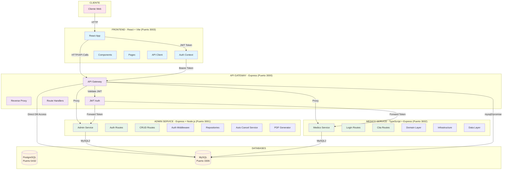

# Arquitectura Actual del Sistema de Citas Médicas

## Diagrama de Arquitectura

## Descripción de Componentes

### **1. Frontend (React + Vite)**
- **Tecnología**: React 18, Vite, Tailwind CSS
- **Puerto**: 3003
- **Características**:
  - SPA con enrutamiento protegido
  - Dos contextos de autenticación (Admin y Médico)
  - Componentes reutilizables
  - Interceptores Axios para manejo de tokens

### **2. API Gateway (Express)**
- **Puerto**: 3000
- **Funciones**:
  - Proxy reverso para todos los servicios
  - Autenticación JWT centralizada
  - Enrutamiento inteligente
  - Acceso directo a BD para operaciones de médico
  - Generación de reportes PDF

### **3. Admin Service (Express + Node.js)**
- **Puerto**: 3001
- **Arquitectura**: Capas (Presentation, Infrastructure, Persistence)
- **Funciones**:
  - CRUD de hospitales, especialidades, médicos, empleados
  - Gestión de citas administrativas
  - Servicio automático de cancelación
  - Generación de reportes PDF
  - KPIs y gráficas

### **4. Medico Service (TypeScript + Express)**
- **Puerto**: 3002
- **Arquitectura**: Clean Architecture
- **Capas**:
  - **Domain**: Entities, Use Cases, Repository
  - **Infrastructure**: DataSources, DTOs, Mappers
  - **Presentation**: Routes, Middleware, Server
- **Funciones**:
  - Gestión de citas médicas
  - Perfil de médico
  - Estadísticas personales

### **5. Bases de Datos**
- **MySQL**: Base de datos principal (Puerto 3306)
- **PostgreSQL**: Base de datos alternativa (Puerto 5432)
- **Esquemas**: Hospitales, Médicos, Pacientes, Citas, Especialidades

## Patrones de Comunicación

### **Flujo de Autenticación**
1. Cliente envía credenciales al Gateway
2. Gateway valida y genera JWT
3. Token se almacena en localStorage del frontend
4. Requests posteriores incluyen Bearer token
5. Gateway valida token y enruta a servicios

### **Flujo de Datos**
1. **Frontend** → **Gateway** (HTTP)
2. **Gateway** → **Admin Service** (HTTP Proxy)
3. **Gateway** → **Medico Service** (HTTP Proxy)
4. **Gateway** → **MySQL** (Direct Access para médico)
5. **Services** → **MySQL** (Repository Pattern)

### **Manejo de Errores**
- Interceptores Axios en frontend
- Middleware de autenticación en servicios
- Validación de tokens JWT
- Manejo centralizado de errores en Gateway

## Tecnologías Utilizadas

- **Frontend**: React, Vite, Tailwind CSS, Axios
- **Backend**: Node.js, Express, TypeScript
- **Bases de Datos**: MySQL, PostgreSQL
- **Autenticación**: JWT
- **Contenedores**: Docker, Docker Compose
- **Monorepo**: npm workspaces

