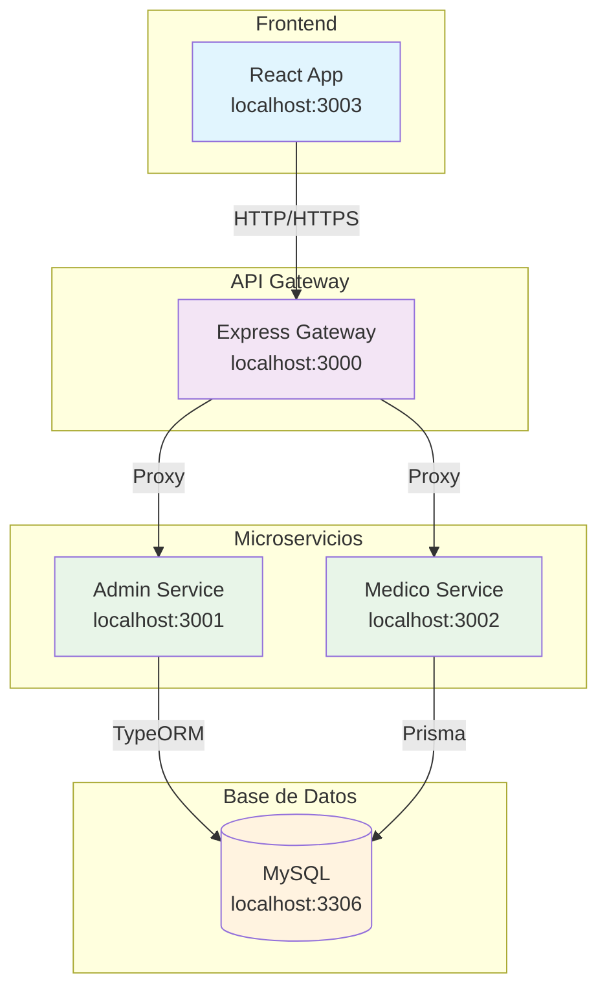
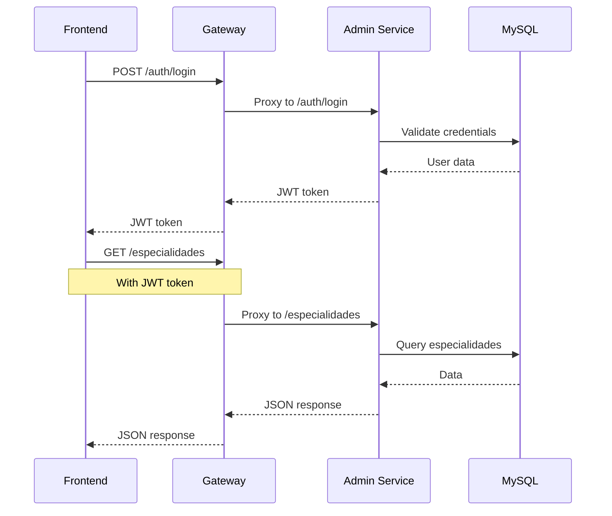
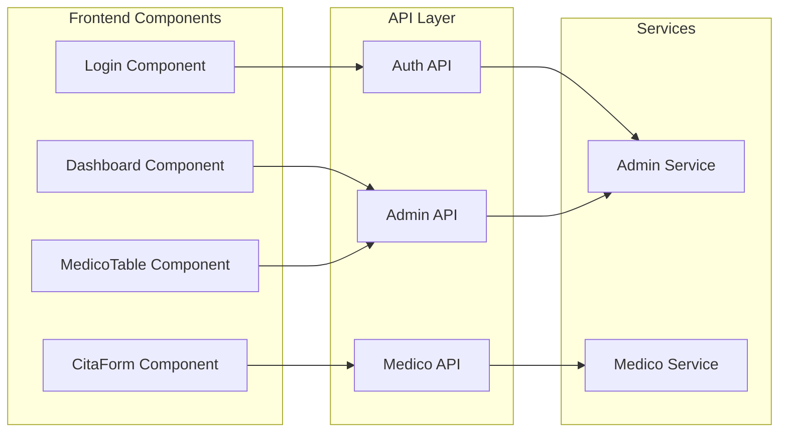

# 📚 Documentación de Arquitectura con Mermaid

## 🎯 Para Diagramas de Arquitectura

### 1. Instalación

```bash
# Instalar Mermaid CLI
npm install -g @mermaid-js/mermaid-cli

# O como dependencia de desarrollo
npm install --save-dev @mermaid-js/mermaid-cli
```

### 2. Diagrama de Arquitectura General

#### docs/diagrams/architecture.mmd


### 3. Diagrama de Flujo de Datos

#### docs/diagrams/data-flow.mmd


### 4. Diagrama de Componentes

#### docs/diagrams/components.mmd


### 5. Scripts para Generar Diagramas

#### package.json
```json
{
  "scripts": {
    "docs:diagrams": "mmdc -i docs/diagrams/architecture.mmd -o docs/images/architecture.png",
    "docs:diagrams:all": "mmdc -i docs/diagrams/ -o docs/images/ -e png",
    "docs:serve": "http-server docs -p 8080"
  }
}
```

### 6. Integración con README

#### README.md
```markdown
## 🏗️ Arquitectura


## 📊 Flujo de Datos


## 🧩 Componentes


```

## 📊 URLs de Documentación

- **Documentación estática**: http://localhost:8080
- **Diagramas**: `./docs/images/`
