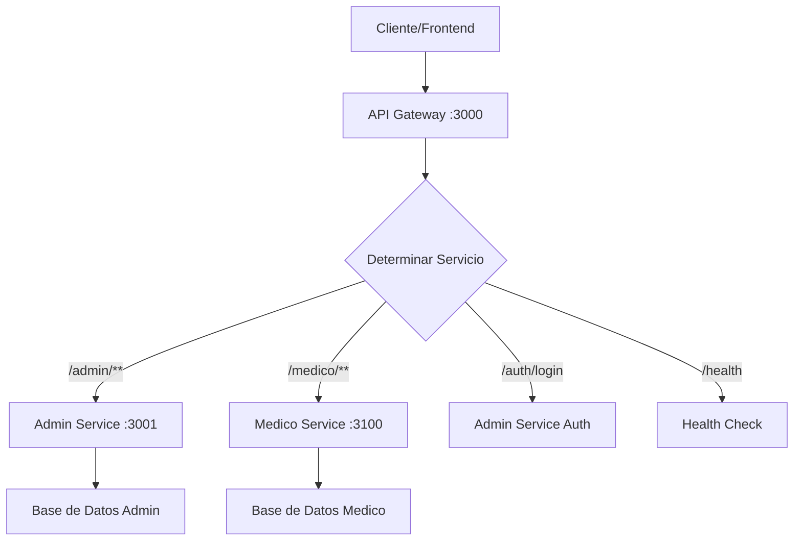

# Arquitectura del API Gateway

## 🏗️ Visión General

El API Gateway actúa como punto de entrada único para el sistema de gestión hospitalaria, proporcionando:

- **Enrutamiento inteligente** entre servicios
- **Seguridad centralizada** (CORS, Rate Limiting, Helmet)
- **Monitoreo de salud** de servicios
- **Documentación automática** con Swagger
- **Trazabilidad** de requests

## 🔄 Flujo de Requests



## 📁 Estructura Modular

### Config (`src/config/index.js`)
- Configuración centralizada
- Variables de entorno
- URLs de servicios
- Configuración de CORS y Rate Limiting

### Middleware (`src/middleware/`)

#### `proxy.js`
- Configuración base de proxies
- Manejo de archivos binarios (PDFs)
- Headers de trazabilidad
- Manejo de errores de proxy

#### `security.js`
- Helmet para headers de seguridad
- CORS configurado
- Rate Limiting configurable

### Routes (`src/routes/`)

#### `auth.js`
- Login de usuarios
- Proxy a Admin Service para autenticación
- Manejo de errores de autenticación

#### `health.js`
- Verificación de salud del gateway
- Monitoreo de servicios backend
- Métricas de tiempo de respuesta

#### `proxy.js`
- Proxy principal con namespacing
- Fallback con axios para compatibilidad
- Manejo de rutas legacy

## 🔐 Seguridad

### Headers de Seguridad (Helmet)
```javascript
helmet({
  contentSecurityPolicy: false, // Deshabilitado para desarrollo
  crossOriginEmbedderPolicy: false
})
```

### CORS
```javascript
cors({
  origin: ['http://localhost:5173', 'http://localhost:3003'],
  credentials: true
})
```

### Rate Limiting
```javascript
rateLimit({
  windowMs: 15 * 60 * 1000, // 15 minutos
  max: 1000, // 1000 requests por IP
  skip: (req) => NODE_ENV === 'development'
})
```

## 🔍 Trazabilidad

Cada request recibe un ID único:
```javascript
req.id = req.headers['x-request-id'] || randomUUID()
```

Este ID se propaga a todos los servicios backend y se refleja en las respuestas.

## 📊 Monitoreo

### Health Check Detallado
```json
{
  "gateway": "healthy",
  "timestamp": "2024-01-01T00:00:00.000Z",
  "services": [
    {
      "name": "admin-service",
      "url": "http://localhost:3001",
      "status": "healthy",
      "statusCode": 200,
      "responseTimeMs": 45,
      "lastCheck": "2024-01-01T00:00:00.000Z"
    }
  ],
  "environment": "development"
}
```

## 🚀 Proxy Inteligente

### Namespacing
- `/admin/**` → `ADMIN_SERVICE_URL`
- `/medico/**` → `MEDICO_SERVICE_URL`

### Fallback con Axios
Para rutas legacy que no usan namespacing:
- `/especialidades`
- `/hospitales`
- `/medicos`
- `/empleados`
- `/citas`

### Manejo de Archivos Binarios
Especial para PDFs en `/admin/citas/reportes/**`:
- `responseType: 'arraybuffer'`
- Preservación de headers
- Manejo de errores específico

## 🔧 Configuración por Entorno

### Desarrollo
- Rate limiting deshabilitado
- CORS permisivo
- Logs detallados
- Swagger UI disponible

### Producción
- Rate limiting activo
- CORS restringido
- Logs optimizados
- Swagger UI opcional

## 📈 Escalabilidad

### Horizontal
- Múltiples instancias del gateway
- Load balancer delante
- Sticky sessions para WebSockets (si es necesario)

### Vertical
- Configuración de límites de memoria
- Timeout configurables
- Buffer management

## 🛠️ Mantenimiento

### Logs
- Morgan para HTTP requests
- Request IDs para trazabilidad
- Errores estructurados

### Health Checks
- Verificación automática de servicios
- Alertas de servicios caídos
- Métricas de tiempo de respuesta

### Documentación
- Swagger automático
- README actualizado
- Arquitectura documentada